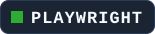
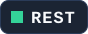
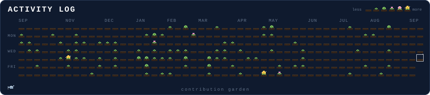

<samp><b>Applied AI | Explainable ML | Human-centered tools</b></samp>  
<samp>CS student building practical AI tools for education, safety, and explainable decision support.</samp>

---

<table>
  <tr>
    <td width="50%" align="center" valign="top">
       
      
       
      
       
      <a href="https://jeeya7.github.io/JiyaPradhan/"><code>users/jeeya7</code></a>
       
       
       
       
    </td>
    <td width="50%" align="center" valign="top">
       
      
       
       
      <samp><b>LANGUAGES</b></samp>
       
      
       
       
      <samp><b>FRAMEWORKS&nbsp;+&nbsp;WEB</b></samp>
       
      
       
       
      <samp><b>ML&nbsp;+&nbsp;DATA</b></samp>
       
      
       
      
      
       
       
      <samp><b>SYSTEMS&nbsp;+&nbsp;TOOLING</b></samp>
       
      
       
      
      
      
      
      
      
       
    </td>
  </tr>
</table>

---

 

 

<samp>contribution garden // powered by real GitHub activity</samp>

---

<table>
  <tr>
    <td align="left" valign="middle" width="42%">
      <samp><b>CONNECT</b></samp>
      &nbsp;&nbsp;
      
      <a href="https://jeeya7.github.io/JiyaPradhan/"><samp>portfolio</samp></a>
      &nbsp;&nbsp;
      
      <a href="https://www.linkedin.com/in/jiyapradhan"><samp>linkedin</samp></a>
      &nbsp;&nbsp;
      
      <a href="mailto:pradhanj@oregonstate.edu"><samp>email</samp></a>
    </td>
    <td align="center" valign="middle" width="30%">
      <samp><b>THANKS FOR VISITING!</b></samp>
    </td>
    <td align="right" valign="middle" width="28%">
      
    </td>
  </tr>
</table>

